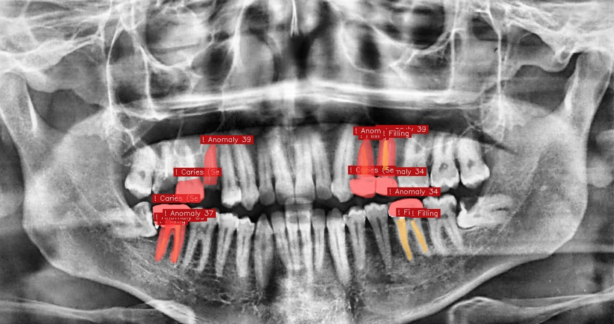

# Gaurav Sharma

**I build tooling for inverse problems.** Radar returns to subsurface geometry, degraded scans to a diagnosis that holds, noisy series to a forecast with an honest interval.

[GSoC write-up](https://alphaleporus.github.io/gsoc-2026-gprmax/) &nbsp;·&nbsp; [LinkedIn](https://www.linkedin.com/in/alphaleporus/) &nbsp;·&nbsp; [X](https://x.com/alphaleporus) &nbsp;·&nbsp; [ORCID](https://orcid.org/0009-0007-8027-9943) &nbsp;·&nbsp; [LeetCode](https://leetcode.com/alphaleporus)

---

## Google Summer of Code 2026 · gprMax

<picture>
  <source media="(prefers-color-scheme: dark)" srcset="assets/stats-dark.svg">
  <source media="(prefers-color-scheme: light)" srcset="assets/stats-light.svg">
  
</picture>

Reading gprMax output meant editing a text file, re-running an FDTD solver from a terminal, and running a matplotlib script that decided for you what to show. It is now six reactive [marimo](https://marimo.io) notebooks over four pure-Python modules. Mentored by Prof. Antonis Giannopoulos and Prof. Craig Warren, University of Edinburgh.

**What turned up along the way.** Almost every real finding came from checking something already written down.

- `fft_power` silently normalises every trace against its own peak, so two traces twenty times apart in amplitude plot identically when overlaid, quietly defeating the comparison the plot was made for
- the ricker source delay is 31% of the standard time window and is not recoverable from the output file, so any predicted arrival that omits it is wrong by a third of the plot
- depth and permittivity are not jointly recoverable from a hyperbola fit, so the velocity recipe takes depth as an input and says why instead of reporting a number it cannot support

**How it was checked.** There was no code review, so something had to replace it.

- every guard is mutation-tested: remove the gain broadcast axis, the negative-gain clip or the bistatic apex offset and a named test fails
- an AST pass asserts marimo's invariants on every change, catching four regressions that `marimo check` does not see
- validated numerically against a real 60-trace solver run, not by eye: the direct wave arrives at 1.113 ns with zero spread across traces, the hyperbola turns over at the predicted source position, and the analytic model reproduces measured arrivals to within 4%

A tool that quietly tunes itself toward the expected answer is worse than no tool.

**[Write-up, figures and validation](https://alphaleporus.github.io/gsoc-2026-gprmax/)** · **[source](https://github.com/alphaleporus/gsoc-2026-gprmax)**

---

## Projects

Tooth-AI reading a panoramic radiograph. Each mask is a separate instance, labelled with its tooth number and what was found there.

| | |
|---|---|
| **Tooth-AI** | Dental OPG analysis with Mask R-CNN instance segmentation and FDI tooth numbering, separating caries, restorations and anomalies per tooth. Under Prof. Nisha Auti, C-CAMP Inter-Institutional Biomedical Innovations Programme. Paper in preparation. |
| **OsteoVision** | EfficientNet-B0 imaging branch fused with a tabular MLP for clinical risk prediction. AUC-ROC 0.972, per-class threshold tuning, MC Dropout for uncertainty. |
| **FleetFusion** | First place, GenAIverse national hackathon. |

## Contributions

| | |
|---|---|
| [sktime](https://github.com/sktime/sktime) | MAAPE and MSLE forecasting metrics, `NaiveForecaster` documentation, forecasting performance — [#9140](https://github.com/sktime/sktime/pull/9140) [#9095](https://github.com/sktime/sktime/pull/9095) [#9086](https://github.com/sktime/sktime/pull/9086) [#9295](https://github.com/sktime/sktime/pull/9295) |
| [mllam/neural-lam](https://github.com/mllam/neural-lam) | Sphinx autodoc harness for the documentation build — [#428](https://github.com/mllam/neural-lam/pull/428) [#442](https://github.com/mllam/neural-lam/pull/442) |
| [Jenkins](https://github.com/jenkinsci) | ARM64 CI/CD fix — #1381 |
| [OpenML](https://github.com/openml/openml-python) | [#1490](https://github.com/openml/openml-python/pull/1490) |
| [marimo](https://github.com/marimo-team/marimo) | Upstream reports for reactive DAG bugs found during GSoC |

---

## Also

**Corruption robustness in medical vision transformers.** How CLAHE preprocessing affects MedViT V1 and V2 across MedMNIST. Write-up in progress.

**Bitcoin protocol development** through Bitshala's Mastering Bitcoin cohort.

**Technical Head, CSI Bharati Vidyapeeth**, running technical programming for 250 students. Media and Cultural Head at ACES.

 

<code>Python</code> <code>Java</code> <code>PyTorch</code> <code>NumPy</code> <code>SciPy</code> <code>scikit-learn</code> <code>marimo</code> <code>Plotly</code> <code>HDF5</code> <code>pytest</code>
  
Final-year Computer Engineering, Bharati Vidyapeeth College of Engineering, Pune. Graduating 2027.

